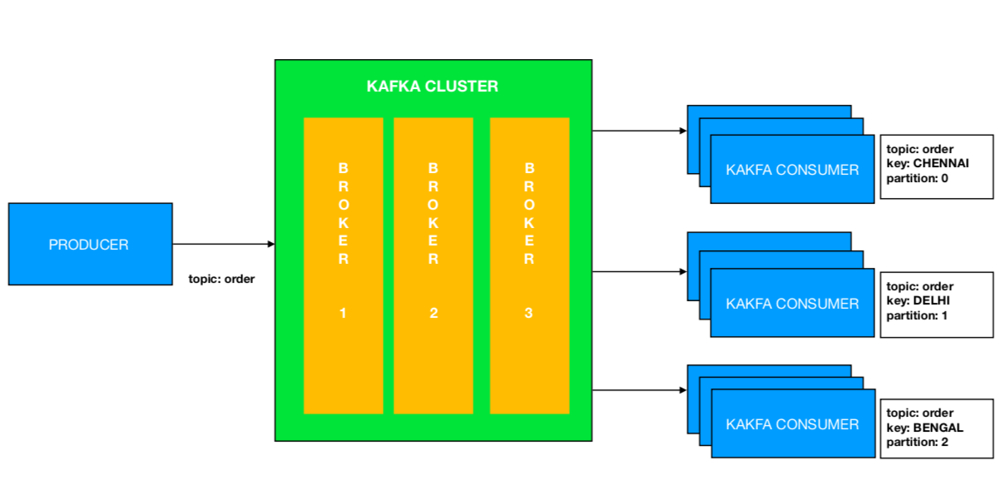

# Kafka - message key distribution

This sample demonstrates the distributon of messages based on message key and parititions. 


# Architecture Flow



# Flow

- Producer publishes order to specific partitions based on location(topic orders).

- Method getPartitionByLocation(String locationName) resolves to a specific partition.

- Consumer receives order based on location and partition. 

# Sample requests:

```
# delhi location
{
  "buyerName": "barath",
  "locationName": "delhi",
  "orderId": 1,
  "price": 1000,
  "productName": "TV"
}

# chennai location
{
  "buyerName": "barath",
  "locationName": "chennai",
  "orderId": 1,
  "price": 1000,
  "productName": "TV"
}

# bengal location
{
  "buyerName": "barath",
  "locationName": "bengal",
  "orderId": 1,
  "price": 1000,
  "productName": "TV"
}

```

> Note: This is for demonstration purpose only.